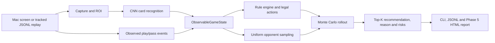

# System architecture

`doudizhu-assistant` separates visual observation, game state, rule evaluation and presentation. Phase 5A reuses the tested offline path and does not introduce automatic game control.

## Dependency boundaries

| Layer | Responsibility | Must not do |
|---|---|---|
| `capture` | Acquire a frame or fixed ROI | Decide which card to play |
| `vision` | Classify card images with confidence | Call the rule engine |
| `state` | Parse cards, reduce events and preserve invariants | Import model frameworks or UI |
| `logic` | Classify plays, generate actions and evaluate decisions | Read screen coordinates or images |
| `pipeline` | Orchestrate real-time capture and stabilization | Hide rules inside the UI loop |
| `reporting` | Build reproducible JSON/Markdown/HTML evidence | Change game state or model output |

## Current honest boundary

The Mac runtime recognizes the local player's hand. It does not yet observe opponent plays, pass signals or remaining-card counters automatically. Phase 4/5 therefore uses explicit, versioned JSONL events for full-state decision evaluation. The system does not click cards or play automatically.
