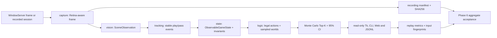

# System architecture

`doudizhu-assistant` separates window capture, visual evidence, temporal event tracking, observable game state, decision evaluation, and read-only presentation. The system never clicks cards or controls the game client.

```mermaid
flowchart LR
    A["WindowServer frame or recorded session"] --> B["capture: Retina-aware frame"]
    B --> C["vision: SceneObservation"]
    C --> D["tracking: stable play/pass events"]
    D --> E["state: ObservableGameState + invariants"]
    E --> F["logic: legal actions + sampled worlds"]
    F --> G["Monte Carlo Top-K + 95% CI"]
    G --> H["read-only Tk, CLI, Web and JSONL"]
    B --> I["recording manifest + SHA256"]
    H --> J["replay metrics + input fingerprints"]
    I --> K["Phase 6 aggregate acceptance"]
    J --> K
```

## Dependency boundaries

| Layer | Responsibility | Must not do |
|---|---|---|
| `capture` | Acquire WindowServer frames, handle Retina geometry, read recorded sessions | Classify cards or choose an action |
| `config` | Own reusable configuration models, including `LiveLayoutConfig` | Import runtime orchestration |
| `vision` | Produce card, role, pass, turn and remaining-count observations with confidence | Import `pipeline` or call the rule engine |
| `tracking` | Fuse frames and emit only stable, ordered visual events | Simulate opponents or render UI |
| `state` | Reduce events, preserve 54-card invariants and represent unknown history | Read images or import model frameworks |
| `logic` | Classify plays, generate legal actions and evaluate sampled worlds | Read screen coordinates, images or UI controls |
| `pipeline` | Orchestrate capture, vision, tracking, state, async decisions and snapshots | Hide rules in the runtime loop |
| `ui` | Render immutable snapshots and accept an explicit rescan command | Own capture, recognition or state mutation |
| `reporting` | Build reproducible showcase, diagnostics and acceptance evidence | Change game state or model output |

`src/pipeline/live_layout.py` remains only as a compatibility re-export. The implementation lives in `src/config/live_layout.py`, so `vision` has no reverse dependency on `pipeline`.

## Runtime safety and lifecycle

- A recommendation is published only when the latest visible hand, state revision, legal-action set, best action and Top-K agree.
- Low-confidence, missing or contradictory evidence moves tracking to `uncertain` and hides the recommendation.
- The vision process is isolated from Tk. Restart and shutdown explicitly close process handles and multiprocessing queues.
- The PID file is written atomically and removed only by its owning process. The launcher removes only demonstrably stale or mismatched records.
- Error screenshots are grouped by stable reason, rate-limited by cooldown, and capped per round and per session.
- Live JSONL uses change-based writes plus a heartbeat and rotates at 64 MiB without discarding archived logs.

## Decision semantics

The opponent model samples uniformly from the cards that remain possible after removing the local hand, observed plays and unknown historical discards. It is an explainable baseline, not a calibrated behavioural model. Each action reports its sampled win rate, standard error and normal 95% confidence interval; overlapping intervals are surfaced as ranking uncertainty.

## Evidence and acceptance

Every recorded session has immutable identity metadata, a config snapshot, per-frame full-image SHA256 and per-ROI SHA256. Interrupted recording persists its committed frame count and requires an explicit finalize step. Replay provenance binds the recording manifest, config, model, template tree, implementation source hash, runtime versions and events log; evaluation then binds action and scene annotations. The aggregate Phase 6 audit rejects:

- fewer than five independent complete sessions;
- missing or invalid annotations, metadata or evaluation reports;
- reused frames across sessions;
- overlapping capture time ranges across sessions;
- recordings, replay assets or annotations changed after their fingerprints were created;
- event/card/remaining metrics below their thresholds;
- deck-invariant failures or insufficient complete-round success;
- a missing independent real-window card holdout.

The complete workflow and threshold definitions are in [PHASE6_ACCEPTANCE.md](PHASE6_ACCEPTANCE.md).

## Current honest boundary

The offline engineering and evidence pipeline is complete and quality-gated. Real-window generalization is not yet established because the repository currently lacks 5–10 newly recorded, independently annotated complete games and an independent card holdout. The historical Phase 2 `100%` figures cover only the small local fixed-ROI dataset and must not be presented as live-game accuracy.
